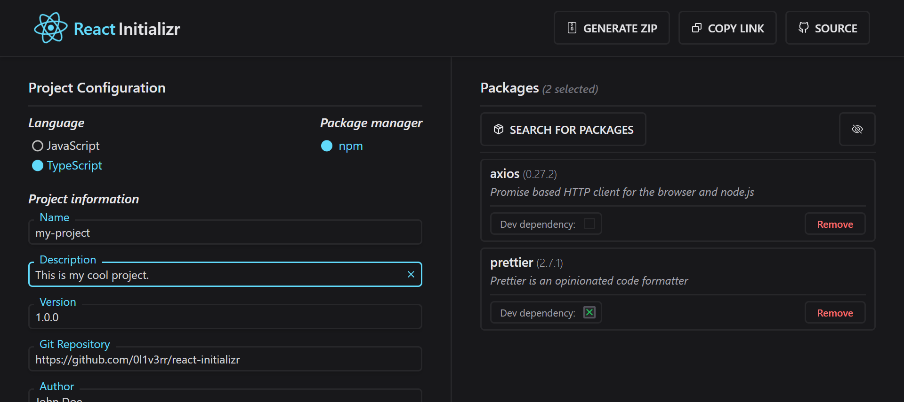

<h1>

📦 React Initializr <a href="https://makeapullrequest.com"></a> <a href="https://github.com/0l1v3rr/react-initializr/releases"></a>

</h1>

- [❓ What is React Initializr?](#-what-is-react-initializr)
- [🕹️ Features](#️-features)
- [❗ Important](#-important)
- [⌨️ Hotkeys](#️-hotkeys)
- [📚 Teach stack](#-teach-stack)
- [⚒️ Building from source](#️-building-from-source)
- [🐋 Building with Docker](#-building-with-docker)
- [📝 License](#-license)
- [🧑‍🤝‍🧑 Contributing](#-contributing)
- [💡 Inspiration](#-inspiration)

<hr>

## ❓ What is React Initializr?

<a href="https://0l1v3rr.github.io/react-initializr/" target="_blank">React Initializr</a> is a simple, easy-to-use, web-based, boilerplate-free project generator.

Generate modern <a href="https://reactjs.org/" target="_blank">React</a> templates without barely touching the terminal - just fill in some input fields, add your beloved dependencies, and generate your project!



<hr>

## 🕹️ Features
- **Selecting packages** 
  - You can browse amongst every available npm package thanks to the [NPM Registry API](https://github.com/npm/registry).
  - You can add the selected package as a "dev dependency".
- **TypeScript**
  - Prefer to use TypeScript? You can totally do that, just select the `TypeScript` option before generating the project. The site will add all the necessary dependencies and files, you don't have to do anything else. 
- **Share your project**
  - If you're about to create a tutorial, a blog, or something that requires sharing your _"starting point"_ with others, just click on the **"Copy Link"** button. If anyone opens that link, they can download the same exact project you created. Therefore you can almost skip the "generating project" phase.
- **Dotfiles**
  - There are some available boilerplate dotfiles, config files, or utility files you can generate your project with. Just select the one you want under the "Select Dotfiles" section, and generate your project!
  - Adding a new dotfile through contribution is highly appreciated. [Here's a guideline](https://github.com/0l1v3rr/react-initializr/issues/15).
- **Hotkeys**
  - In order to make interacting with the site more convenient, you can use keyboard shortcuts. You can find a list [here](#️-hotkeys).

<hr>

## ❗ Important

- The site generates a ZIP file. Just unzip it, `cd` to the folder (`cd my-project`), and run the command `npm i`. If you've successfully done this, you're good to go.

<hr>

## ⌨️ Hotkeys

In order to make the site more convenient, you can use some keyboard shortcuts.  
**These shortcuts are the following:**

- <kbd>Shift</kbd> + <kbd>G</kbd> - Generates the project
- <kbd>Shift</kbd> + <kbd>C</kbd> - Copies the link you can share with others
- <kbd>Shift</kbd> + <kbd>S</kbd> - Navigates you to this GitHub page
- <kbd>Shift</kbd> + <kbd>P</kbd> - Opens the packages popup window
- <kbd>Shift</kbd> + <kbd>D</kbd> - Deletes the added dependencies (except for the default ones)
- <kbd>Shift</kbd> + <kbd>L</kbd> - Resets the project information to default
- <kbd>Shift</kbd> + <kbd>H</kbd> - Hides/Shows the default packages in the packages list
- <kbd>Shift</kbd> + <kbd>T</kbd> - Changes the React theme color to something random
- <kbd>Shift</kbd> + <kbd>R</kbd> - Resets the React theme color to its original color
- <kbd>Escape</kbd> - Closes every open popup window

<hr>

## 📚 Teach stack

Shout-out to the creators for creating these tools:

- [TypeScript](https://www.typescriptlang.org/)
- [React](https://reactjs.org/)
- [React-Icons](https://react-icons.github.io/react-icons/)
- [Axios](https://github.com/axios/axios)
- [File-Saver](https://github.com/eligrey/FileSaver.js/)
- [JSZip](https://stuk.github.io/jszip/)
- [Recoil](https://recoiljs.org/)
- [Tailwind](https://tailwindcss.com/)
- [React GH Pages](https://github.com/gitname/react-gh-pages)

<hr>

## ⚒️ Building from source

If you don't have NodeJS, [download and install it](https://nodejs.org/en/).  
Then open a terminal and type these commands:

```sh
# 1. Clone the project:
git clone https://github.com/0l1v3rr/react-initializr.git
cd react-initializr

# 2. Install the dependencies:
npm i

# 3. Run the application:
npm start
```

<hr>

## 🐋 Building with Docker

If you don't have Docker, make sure to [install it](https://www.docker.com/get-started/).  
After cloning the repository, make the project's root directory active in your terminal and type these commands:

```sh
# 1. Build the Docker image
npm run docker:build

# 2. Docker tag (basically naming the image)
npm run docker:tag

# 3. Run the image
npm run docker:run

# Last, (Optional): Remove the image if you're done
npm run docker:clean
```

<hr>

## 📝 License

This project is licensed under the [MIT License](LICENSE).

<hr>

## 🧑‍🤝‍🧑 Contributing

Every contribution is welcomed.  
You can find a contributing guideline [here](CONTRIBUTING.md).

<hr>

## 💡 Inspiration

I was inspired by [start.spring.io](https://start.spring.io/), check it out as well. :\*
