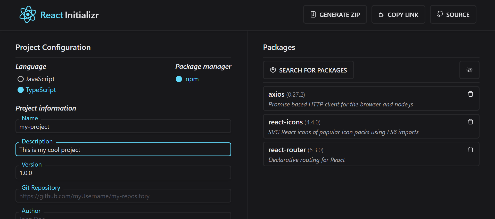

# React Initializr

<a href="0l1v3rr.github.io/react-initializr" target="_blank">React Initializr</a> is a simple, easy-to-use, web-based, boilerplate-free project generator.  

Generate modern <a href="https://reactjs.org/" target="_blank">React</a> templates without barely touching the terminal - just fill in some input fields, add your beloved dependencies, and generate your project!  

You can browse amongst every available npm package thanks to the <a href="https://github.com/npm/registry" target="_blank">NPM Registry API</a> and add them to your project.  

If you prefer to use **TypeScript** you can totally do that too, just select the `TypeScript` option before generating the project. The site will add all the necessary dependencies and files, you don't have to do anything else.  

Share your project with others - if you're about to create a tutorial, a blog, a course, or something that requires sharing your *"starting point"* with others, just click on the **"Copy Link"** button. If anyone opens that link, they can download exactly the same project as you did. Therefore you can almost skip the "generating" phase.  
**Example:** [https://0l1v3rr.github.io/react-initializr?name=my-project&version=1.0.0&description=This+is+my+cool+project&language=TypeScript&packages=axios%3Breact-icons%3Breact-router](https://0l1v3rr.github.io/react-initializr?name=my-project&version=1.0.0&description=This+is+my+cool+project&language=TypeScript&packages=axios%3Breact-icons%3Breact-router)



<hr>

## Important
* The site generates a ZIP file. Just unzip it, `cd` to the folder (`cd my-project`), and run the command `npm i`. If you've successfully done this, you're good to go.  

* You can find the boilerplate-free templates [here]([./templates](https://github.com/0l1v3rr/react-initializr/tree/master/templates)). The site uses these as a base to generate your next project! ;)

<hr>

## Teach stack
Shout-out to the creators for creating these tools:
- [TypeScript](https://www.typescriptlang.org/)
- [React](https://reactjs.org/)
- [React-Icons](https://react-icons.github.io/react-icons/)
- [Axios](https://github.com/axios/axios)
- [File-Saver](https://github.com/eligrey/FileSaver.js/)
- [JSZip](https://stuk.github.io/jszip/)
- [Recoil](https://recoiljs.org/)
- [Tailwind](https://tailwindcss.com/)

<hr>

## Building from source
This process should only take a few steps.  

0. If you don't have NodeJS, [download and install it](https://nodejs.org/en/).
1. Clone the project:
    ```sh
    git clone https://github.com/0l1v3rr/react-initializr.git
    cd react-initializr
    ```
2. Install the required dependencies:
    ```sh
    npm i
    ```
3. Now, you can run the app:
    ```sh
    npm start
    ```

<hr>

## License
This project is licensed under the MIT License.

<hr>

## Contributing
Every contribution is welcomed.  
You can find a contributing guideline [here](CONTRIBUTING.md).

<hr>

## Inspiration
I was inspired by [start.spring.io](https://start.spring.io/), check it out as well. :*